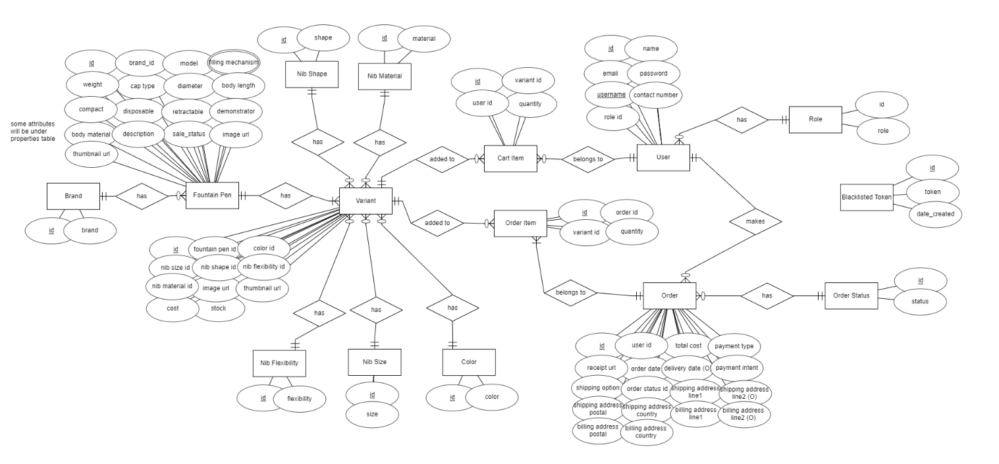
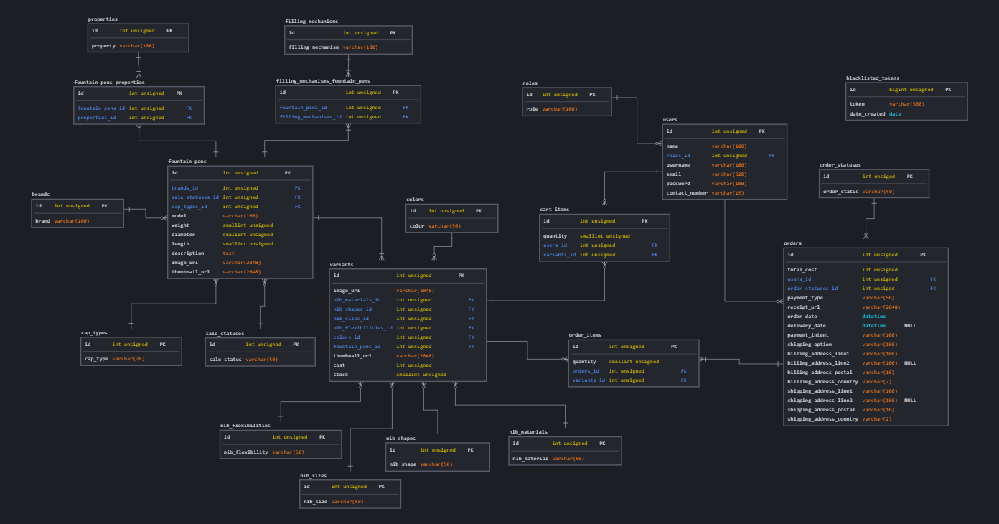
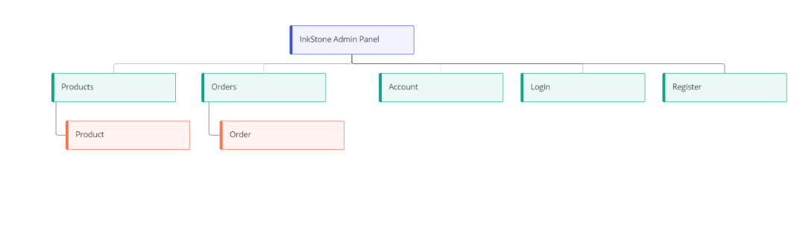
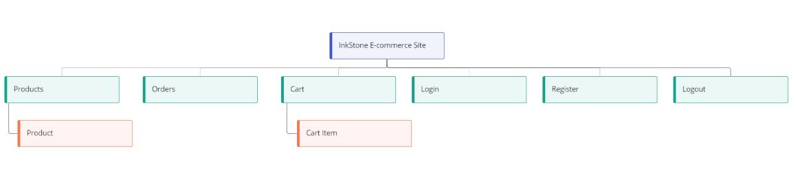
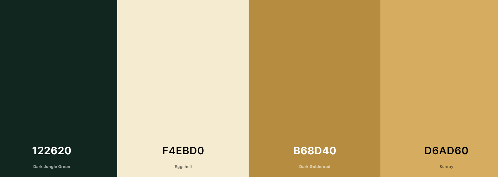

# **InkStone**


Link to demo : [InkStone](https://inkstone-react.netlify.app/)

#### Test Accounts:

-   Admin Panel at [InkStone Express](https://inkstone-express.herokuapp.com/accounts/login)

    -   Username: admin
    -   Password: admin

-   React Frontend at [InkStone React](https://inkstone-react.netlify.app/)
    -   Username: customer
    -   Password: rotiprata123

## Summary

InkStone is an e-commerce web application for fountain pens. This e-commerce web application is designed with fountain pen enthusiasts in mind, with features such as searching by fountain specifications. 

---

## UI/UX

### Strategy

#### Organisational Goals

To create an e-commerce web application to sell fountain pens exclusively. The organisation aims to serve as a platform where customers can browse and purchase fountain pens exclusively.

#### User Goals

| User Stories | Accceptance Criteria |
| ------------ | -------------------- |
| As a fountain pen enthusiast, I would like to get a LAMY Vista fountain pen | Fountain pens need to be searchable by brand and model |
| As a fountain pen enthusiast, I would like to get a fountain pen that supports the use of converters filling mechanism | Fountain pens need to be categorised by the various filling mechanisms |
| As a fountain pen hobbyist, I would like to get a fountain pen that has a flexible nib for writing cursive | Fountain pens need to be categorised by nib flexibility |
| As a fountain pen hobbyist, I would like to get a fountain pen that has a broad nib size | Fountain pens need to be categorised by nib size |
| As a fountain pen hobbyist, I would like to get a fountain pen that has an italic nib | Fountain pens need to be categorised by nib shape |
| As a fountain pen hobbyist who is looking to get another fountain pen, I would like to find one that fits my budget | Fountain pens need to be searchable by cost range |

### Structure and Skeleton

#### Database



Entity-Relationship Diagram (ERD) is drawn to demostrate the various relationships between entities for the website prior to modelling the database in MySQL.



Logical schema is then drawn based on the ERD diagram.

An Express server is then set up and deployed to [Heroku](https://www.heroku.com/), where API endpoints are accessible via the base URL at [https://inkstone-express.herokuapp.com/api/](https://inkstone-express.herokuapp.com/api/).

#### Sitemap

The sitemap for InkStone Express (admin panel) is as follows:


The sitemap for InkStone React (e-commerce frontend) is as follows:


#### Wireframes

[Wireframes]()

### Design Decisions

#### Color scheme



The color scheme chosen revolves around a dark-green primary color and gold accent color to emphasize the theme of luxury and elegance.

#### Fonts

*Eagle Lake* is the font family used for the brand as it resembles the handwritten cursive font that can be achieved using a fountain pen. The serif font also serves to represent the idea of luxury and elegance that the website is aiming to achieve.

*Work Sans* is the font family used for the texts in the website as it maintains great readability whether used at small or large sizes. It is also chosen because of its compatibility with the *Eagle Lake* font family.

---

## Features

### Backend

| Features | Description |
| -------- | ----------- |
| Login and Registration of admin / staff | Only admin /staff can access the admin panel via their account |
| Management of products and variants | Search for products and perform create, update, and delete operations on products and variants | 
| Management of orders | Search for orders and perform update operations on orders |

### Frontend

| Features | Description |
| -------- | ----------- |


---

## Limitations and Future Implementations

---

## Technologies Used

### Backend

| Technology | Description |
| ----------- | ----------- |
| [Express](https://expressjs.com/) | Web application framework used |
| [Bookshelf.js](https://bookshelfjs.org/index.html) | JavaScript ORM used for querying SQL databases |
| [knex](https://knexjs.org/) | Query builder for PostgreSQL, MySQL, CockroachDB, SQL Server, SQLite3 and Oracle on node.js |
| [db-migrate](https://db-migrate.readthedocs.io/en/latest/) | Database migration framework used |
| [Axios](https://axios-http.com/docs/intro) | HTTP Client |
| [Caolan Forms](https://github.com/caolan/forms) | Create and validate forms |
| [CORS](https://www.npmjs.com/package/cors) | Middleware to enable Cross-Origin Resource Sharing (CORS) |
| [csurf](https://www.npmjs.com/package/csurf) | CSRF protection middleware |
| [dotenv](https://www.npmjs.com/package/dotenv) | To allow loading of environment variables from .env file |
| [express-session](https://www.npmjs.com/package/express-session) | Session management middleware |
| [connect-flash](https://www.npmjs.com/package/connect-flash) | Middleware to enable Flash messages |
| [express-flash](https://www.npmjs.com/package/express-flash) | Extension of connect-flash to enable definition and rendering of flash message without redirecting request  |
| [JSON Web Token](https://jwt.io/) | Authentication framework with Frontend |
| [Handlebars](https://handlebarsjs.com/) | Used to generate HTML templates for admin panel |
| [handlebars-helpers](https://github.com/helpers/handlebars-helpers) | Handlebars helpers |
| [wax-on](https://www.npmjs.com/package/wax-on) | Add support to Handlebars for template inheritance with `block` and `extends` helpers |
| [Cloudinary](https://cloudinary.com/) | Image hosting service used for upload and storage of images |


### Frontend

| Technology | Description |
| ----------- | ----------- |
| [React](https://reactjs.org/) | Frontend framework |
| [React Router DOM](https://v5.reactrouter.com/web/guides/quick-start) | Handle routing in React web application |
| [Axios](https://axios-http.com/docs/intro) | HTTP Client |
| [React Bootstrap](https://react-bootstrap.github.io/) | BootStrap for React application |
| [Bootstrap](https://getbootstrap.com/docs/5.0/getting-started/introduction/) | Used for styling of web application |
| [Font Awesome](https://fontawesome.com/) | Used for icons displayed on web application |
| [Stripe](https://stripe.com/en-sg) | Payment gateway used in web application |


---

## Testing

The website is tested for responsiveness using Developer Tools on Chrome browser for mobile, tablet and desktop screen widths.
The test cases can be found [here]().

---

## Deployment

### Frontend

The website is hosted using [Netlify](https://www.netlify.com/), deployed directly from the main branch of this Github repository.
For the detailed deployment steps, you can refer to the blog post on Netlify [here](https://www.netlify.com/blog/2016/09/29/a-step-by-step-guide-deploying-on-netlify/).

### Backend

The Express server is hosted using [Heroku](https://www.heroku.com/), deployed directly from the main branch of the Github repository [here]().
For the detailed deployment steps, you can refer to the documentation on Heroku [here](https://devcenter.heroku.com/articles/git#deploy-your-code).

The Express server makes use of the following environment variables:

```
SESSION_SECRET=

DB_DRIVER=
DB_USER=
DB_PASSWORD=
DB_DATABASE=
DB_HOST=

CLOUDINARY_NAME=
CLOUDINARY_API_KEY=
CLOUDINARY_API_SECRET=
CLOUDINARY_UPLOAD_PRESET=

TOKEN_SECRET=
REFRESH_TOKEN_SECRET=

STRIPE_PUBLISHABLE_KEY=
STRIPE_SECRET_KEY=

STRIPE_SUCCESS_URL=
STRIPE_CANCEL_URL=
STRIPE_ENDPOINT_SECRET=
```

---

## Credits and Acknowledgement

- Fonts are taken from [Google Fonts](https://fonts.google.com/)

- Icons are taken from [Font Awesome](https://fontawesome.com/)

- CSS spinner is adapted from [SpinKit](https://tobiasahlin.com/spinkit/)

- Box-shadow styling is taken from [CSS Scan](https://getcssscan.com/css-box-shadow-examples)

- Product images are taken from [Faber-Castell](https://www.faber-castell.com.sg/products/fine-writing)

- Code for Stripe checkout is adapted from [Jerrysuper123](https://github.com/Jerrysuper123/artisanBread)

- Responsive website mockup is created using [CreateMockup.com](https://www.createmockup.com/generate/)
